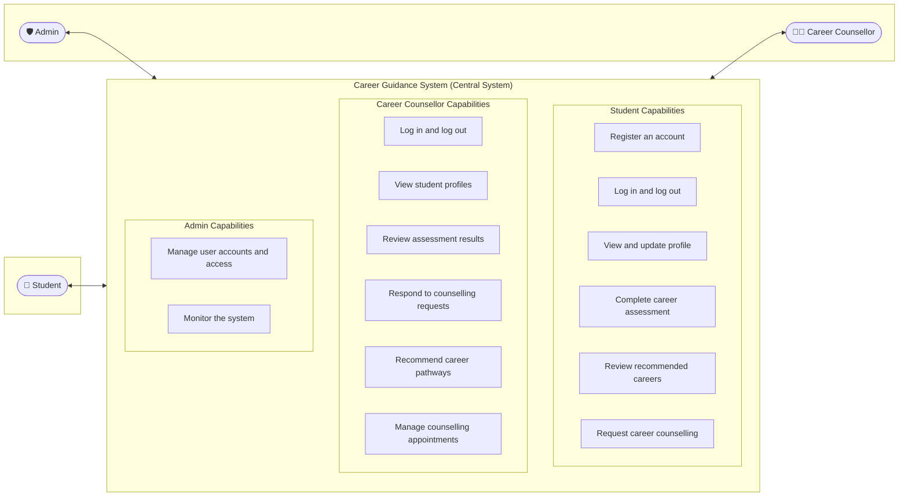

# Career Guidance System

The **Career Guidance System** is a comprehensive PHP and MySQL web application designed to guide students toward informed career decisions through RIASEC career assessments, evidence-based recommendations, tailored career pathways, and one-on-one appointments with certified career counsellors.

---

## Career Guidance System — Use Case Diagram



### System Actors & Use Cases Specification

#### 1. Student
- **Register an account**: Sign up with name, email, education level, and password; verify account via OTP.
- **Log in and log out**: Secure session authentication with role-based dashboard redirection.
- **View and update profile**: Maintain personal details, education history, and career resumes.
- **Complete career assessment**: Take the RIASEC assessment (Realistic, Investigative, Artistic, Social, Enterprising, Conventional) and unlock personalized trait analytics.
- **Review recommended careers**: Review matched careers with explanation rationales, alongside personalized **Counsellor Pathway Recommendations** given by certified counsellors.
- **Request career counselling**: Submit guidance inquiries with preferred date/times, view counsellor responses, and track scheduled appointments and action plans.

#### 2. Career Counsellor
- **Log in and log out**: Access the dedicated Counsellor Portal.
- **View student profiles**: Browse registered students, view academic background, contact details, and submitted resumes.
- **Review assessment results**: Examine student RIASEC scores via visual radar charts and percentage breakdowns, review quiz knowledge checks, and grade written simulation tasks.
- **Respond to counselling requests**: Review student inquiries, reply with constructive career advice, and optionally book an appointment directly.
- **Recommend career pathways**: Formulate tailored career roadmaps for students with milestones, recommended certifications, and guidance notes.
- **Manage counselling appointments**: Schedule guidance sessions (online video, in-person, phone call), update/reschedule, and complete appointments with structured student action plans.

#### 3. Admin
- **Manage user accounts and access**: View all accounts, filter by role and status, provision new accounts, edit profiles, reset passwords, and suspend/activate access.
- **Monitor the system**: Real-time System Monitoring Dashboard tracking server health (PHP/MySQL telemetry, memory usage), user account distribution, assessment completion rates, counselling engagement, and live audit logs.

---

## Connections

- **Student ↔ Career Guidance System** (bidirectional)
- **Career Guidance System ↔ Career counsellor** (bidirectional)
- **Admin ↔ Career Guidance System** (bidirectional)

---

## Default User Accounts for Evaluation

| Role | Email | Password | Primary Portal |
| --- | --- | --- | --- |
| **Student** | `student@careersim.test` | `Student123!` | [My Guidance Dashboard](dashboard/progress.php) |
| **Career Counsellor** | `counselor@careersim.test` | `Counselor123!` | [Counsellor Dashboard](counselor/index.php) |
| **Admin** | `admin@careersim.test` | `Admin123!` | [Admin Dashboard](admin/index.php) |

*(Note: On the login page, click any of the "Quick Demo Accounts" buttons to instantly fill credentials).*

---

## Key Modules and File Directory

```text
├── includes/
│   ├── functions.php          # Core utilities, authorization, DB helpers
│   ├── header.php             # Main site header with role-based navigation
│   └── footer.php             # Site footer
├── auth/
│   ├── login.php              # User login & role redirection
│   ├── logout.php             # Session termination
│   ├── register.php           # Student registration
│   ├── verify_otp.php         # OTP verification
│   └── forgot_password.php    # Password recovery
├── assessment/
│   └── interest.php           # RIASEC Career Assessment
├── dashboard/
│   ├── progress.php           # Student guidance progress & recommended careers
│   ├── profile.php            # View and update student profile
│   └── counselling.php        # Student counselling requests & scheduled appointments
├── counselor/
│   ├── index.php              # Counsellor dashboard & student directory
│   ├── student_view.php       # Student profile & RIASEC assessment review
│   ├── requests.php           # View & respond to counselling requests
│   ├── respond_request.php    # Endpoint for responding to requests
│   ├── appointments.php       # Manage counselling appointments & action plans
│   ├── save_appointment.php   # Endpoint to create, reschedule, or complete sessions
│   └── recommend_pathway.php  # Endpoint to recommend career pathways
├── admin/
│   ├── index.php              # Admin reports & summary
│   ├── monitor.php            # Real-time System Monitor (Monitor the system)
│   ├── users.php              # User accounts & access management
│   ├── save_user.php          # Endpoint for creating & editing user accounts
│   ├── careers.php            # Career catalog management
│   └── logs.php               # System audit log viewer
├── ajax/
│   ├── counselling_request_submit.php  # Student counselling request submission
│   ├── counselling_request_cancel.php  # Student request cancellation
│   ├── profile_update.php              # Student personal profile update
│   ├── education_save.php              # Student education background save
│   └── resume_upload.php               # Resume document upload
└── db/
    ├── schema.sql             # Full database schema
    ├── seed.sql               # Seed data
    └── migrations/            # Incremental migrations
```

---

## Technology Stack

- **Backend**: PHP 8.1+
- **Database**: MySQL 8.0+ / MariaDB
- **Frontend**: Bootstrap 5.3, Bootstrap Icons, Chart.js
- **Architecture**: Role-Based Access Control (RBAC), CSRF protection, Prepared SQL Statements, Responsive Web Design

---

## Environment & Run Instructions

1. Ensure MySQL and Apache are running:
   ```bash
   sudo systemctl status apache2   # or httpd / xampp
   sudo systemctl status mysql
   ```
2. Database configuration is in [`config/database.php`](config/database.php).
3. Access the application in your browser at:
   ```text
   http://localhost/Virtual%20career%20simulation%20system/
   ```
